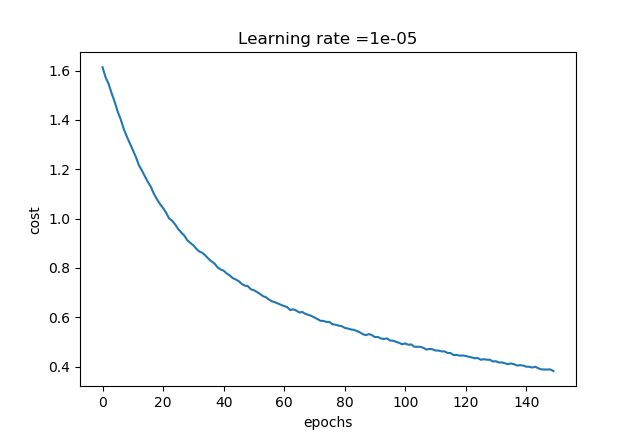
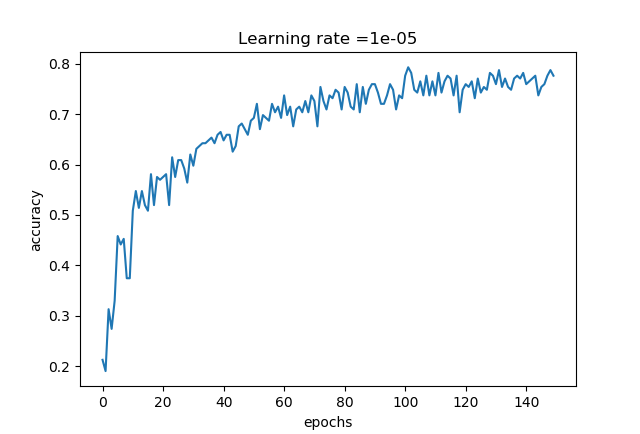

# Hand-Gesture-Classification
Hand gesture classification using convolutional neural network

## Architecture:

CONV2D -> RELU -> MAXPOOL -> CONV2D -> RELU -> MAXPOOL -> FLATTEN -> FULLYCONNECTED

Conv2D 1: stride 1, padding is "SAME"

Max pool: Used an 8 by 8 filter size and an 8 by 8 stride, padding is "SAME"

Conv2D 2: stride 1, padding is "SAME"

Max pool: Used a 4 by 4 filter size and a 4 by 4 stride, padding is "SAME"

FULLYCONNECTED (FC) layer: fully connected layer without an non-linear activation function.

## Cost vs No of epochs:

## Validation accuracy vs no of epochs

